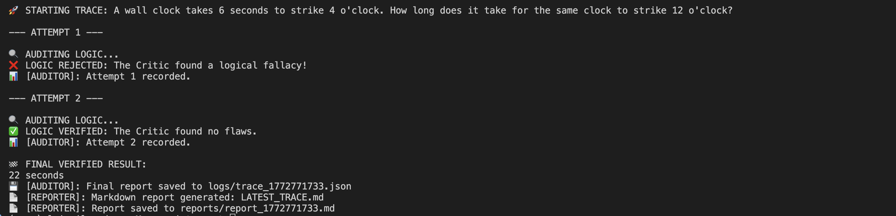

# 🛡️ VeriTrace
**High-Precision Agentic Logic with Trajectory Auditing**

VeriTrace is an AI orchestration pipeline designed to eliminate logical 'hallucinations' across complex reasoning and engineering tasks through real-time auditing. By implementing an **Agent-Critic-Auditor** loop, the system verifies reasoning trajectories before finalizing a response, ensuring mathematical and logical rigor.


## 🏗️ The Architecture
VeriTrace moves beyond simple prompting by using a multi-stage validation loop:

1. **The Agent:** Generates a step-by-step "Chain of Thought" (CoT) to solve a given problem.
2. **The Critic:** A specialized high-precision instance that audits the Agent's reasoning for heuristic biases or "traps."
3. **The Auditor:** A persistence layer that captures the full JSON trajectory of the conversation.
4. **The Reporter:** An automated post-processor that transforms raw technical logs into human-readable Markdown audits.

## 🔍 Execution Flow
When the system encounters a "Heuristic Trap," you can see the Critic intervene in real-time. 

While demonstrated here via a heuristic riddle, the VeriTrace architecture is a general-purpose evaluator capable of auditing code refactors, logistical constraints, and structured data extraction.

**Terminal View:**


**Deep Dive:**
- [View the Full Correction Report](./demo/correction_loop_demo.md) — Detailed breakdown of the failure and recovery.
- [View a Success Report](./demo/success_trace_example.md) — Clean execution for a standard logic prompt.

## 🚀 Technical Highlights
* **Stateful Trajectories:** Every "thought" is indexed and versioned in the `logs/` directory.
* **Dual-Stream Reporting:** Generates unique historical reports while maintaining a `LATEST_TRACE.md` for rapid development.
* **Structured Output:** Leverages **Pydantic AI** for type-safe, validated model responses.
* **Model:** Powered by **Gemini 2.5 Flash** for high-speed logical inference.

## 🛠️ Setup & Usage
1. **Clone the repo:**
   ```bash
   git clone [https://github.com/your-username/veri_trace.git](https://github.com/your-username/veri_trace.git)
   cd veri_trace
   ```
2. **Install dependencies**
   ```bash
   pip install -r requirements.txt
   ```
3. **Configure environment**
   Add your GEMINI_API_KEY to a .env file.
4. **Run the loop**
   ```bash
   python main.py
   ```
   

